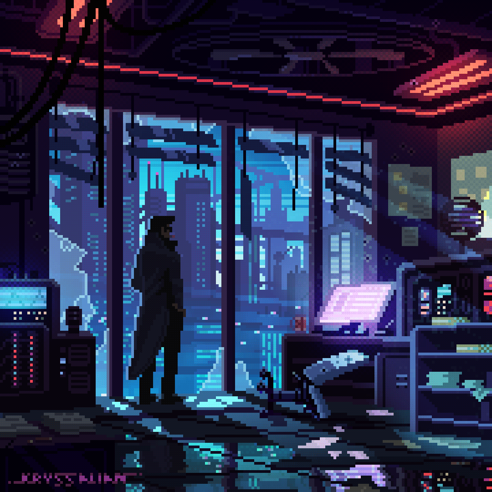

<h1 align="center">Hi 👋, I'm Jyotismoy Kalita</h1>
<h4 align="center">A passionate student and AI/ML, WebDev, Low Level Programming enthusiast from India</h4>

  
  

  <em>
    "The woods are lovely, dark and deep" 
    But I have promises to keep, 
    And miles to go before I sleep, 
    And miles to go before I sleep."  
    — Robert Frost
  </em>

<h3>About Me:</h3>

- 🌱 I’m currently pursuing **B.Tech** in **Information Technology** in Gauhati University.
- 💬 Ask me about: **C/C++, JS/TS, AI/ML, Python, Rust, Web Dev, Git, or IoT**
- 📫 How to reach me: [LinkedIn](https://www.linkedin.com/in/jyotismoy-kalita/) | [Email](mailto:jyotismoykalita@outlook.com)
- ⚡ Fun fact: *I love playing video games, listening to music and travelling*

### 🛠️ Languages and Tools

  

### 🧠 Top Projects

- 🔬 [Drug Detection and Classification](https://github.com/JyotismoyKalita/DrugDetectClassify-IITG)
- 📊 [Inventory Management System](https://github.com/JyotismoyKalita/hackdays)
- 🍉 [Fruit Classification](https://github.com/JyotismoyKalita/FruitClassification)
- 📈 [JLinearRegression](https://github.com/JyotismoyKalita/JLinearRegression)
